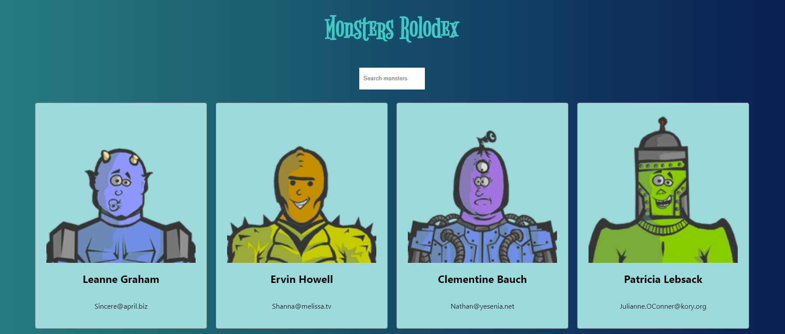

# Monsters Rolodex

## Table of Contents

[Description](#description)

[Technology](#technology)

[Installation](#installation)

[Links](#links)

[Usage](#usage)

[Screenshots](#screenshots)

[Questions](#questions)

## Description
Monsters Rolodex is an application built using React. The application presents a rolodex of monsters shown as cards which the user can filter through via the search bar. The [Robohash](https://robohash.org) website is used to display images of the monsters. Monster information is fetched from [JSONPlaceholder](https://jsonplaceholder.typicode.com/), a REST API that provides fake data for testing and prototyping. This is based on the Complete React Developer in 2021 (w/ Redux, Hooks, GraphQL) Udemy course by ZTM.

## Technology
Key technologies and npm packages of note used in this project:
- React
- react-dom
- HTML
- CSS 
- REST API

## Installation
Fork a copy of the repository and install dependencies by running 'npm install'. Also, to launch the application run 'npm run start' and to deploy on GitHub pages run 'npm run deploy'.

## Links
- [GitHub repository](https://github.com/darylnauman/monsters-rolodex)
- [Deployed application](https://darylnauman.github.io/monsters-rolodex/)

## Usage
Visit the deployed application and type into the search bar to filter the monsters.

## Screenshot

## Questions
Please feel free to contact me if you have any questions.